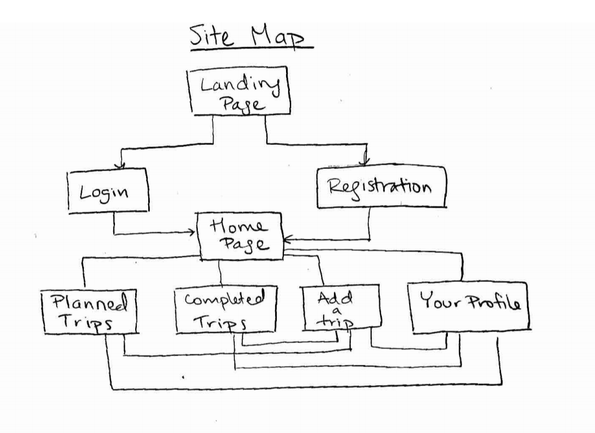

# Adventure Book: Travel Planner

## Overview

(___TODO__: a brief one or two paragraph, high-level description of your project_)

You spend so long dreaming about where you want to go in the world and what you want to do, some things might fall through the cracks. What was that cafe you wanted to go to in Paris? What was that hike you wantted to do in Yosemite? 

Don't worry! Adventure Book is a web app that allows you to keep track of all your travel plans, past and future. Users can register and log in. Once they've logged in, they can create plans for places they want to visit, and can keep track of places they've visited by adding a plan to a list of completed trips. Once they've completed a trip, they can move it to their list of completed trips.

## Data Model

(___TODO__: a description of your application's data and their relationships to each other_) 

The application will store Users and Trips
* users can have a list of planned trips and completed trips
* each trip contains information about where the trip will take place and some other optional info
    * trips are user-specific

An Example User:

```javascript
{
  username: "dreaming_of_paris",
  hash: // a password hash,
  planned: // an array of Trip documents
  completed: // an array of Trip documents
}
```

An Example Trip:
```javascript
{
  user: // a reference to a User object
  place: "Paris, France",
  created: // timestamp
  desc: "A must do. I'll drink wine and eat cheese, visit the Eiffel Tower, and go to the Louvre."
}
```

## [Click Here for Commented First Draft Schema](db.js) 

## Wireframes

Landing page - page to go to when user not registered or  authenticated


Login or Registration Page


Home page - home page when user authenticated


Planned trips page or completed trips page - view all planned trips or view all completed trips, can filter by place 


Add trip - add a new trip, either planned or completed


Profile - view and edit profile information, can supply a bio


## Site map



(___TODO__: draw out a site map that shows how pages are related to each other_)

## User Stories

(___TODO__: write out how your application will be used through [user stories](http://en.wikipedia.org/wiki/User_story#Format) and / or [use cases](https://www.mongodb.com/download-center?jmp=docs&_ga=1.47552679.1838903181.1489282706#previous)_)

1. as non-registered user, I can register a new account with the site
2. as a user, I can log in to the site
3. as a user, I can add a trip
4. as a user, I can specify whether a trip is completed or planned on creation
3. as a user, I can view all my planned trips
4. as a user, I can view all my completed trips
5. as a user, I can move a trip from planned to completed
6. as a user, I can view my profile
7. as a user, I can update my profile with a biography

## Research Topics

* (5 points) User authentication
    * use passport for user authentication
    * will have login and registration
    * passwords will be salted and hashed
    * can only view personal travel list after authentication
* (3 points) unit testing javascript
    * will use mocha  
* (2 points) use CSS framework
    * Materialize or Bootstrap
    * may drop this later

10 points total out of 8 required points

## [Click Here for Initial Main Project File](app.js) 

(___TODO__: create a skeleton Express application with a package.json, app.js, views folder, etc. ... and link to your initial app.js_)

## Annotations / References Used

(___TODO__: list any tutorials/references/etc. that you've based your code off of_)